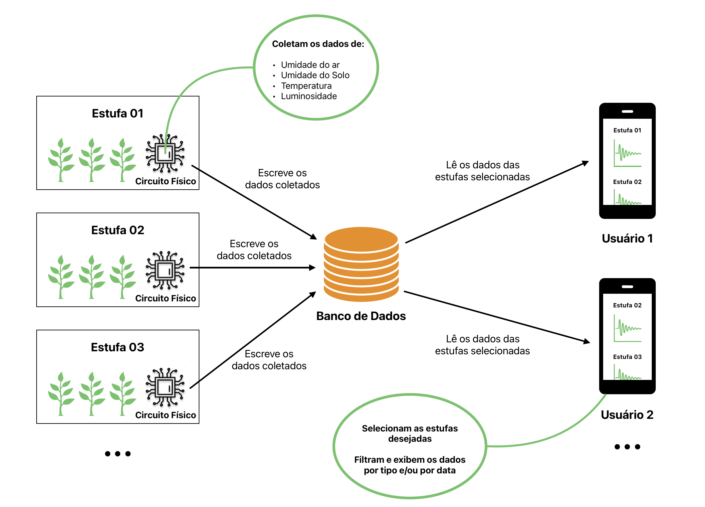
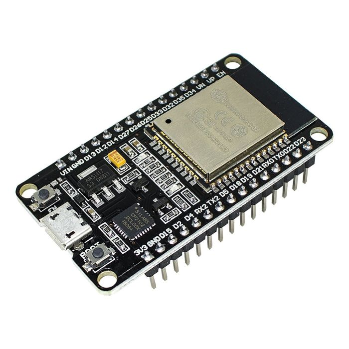
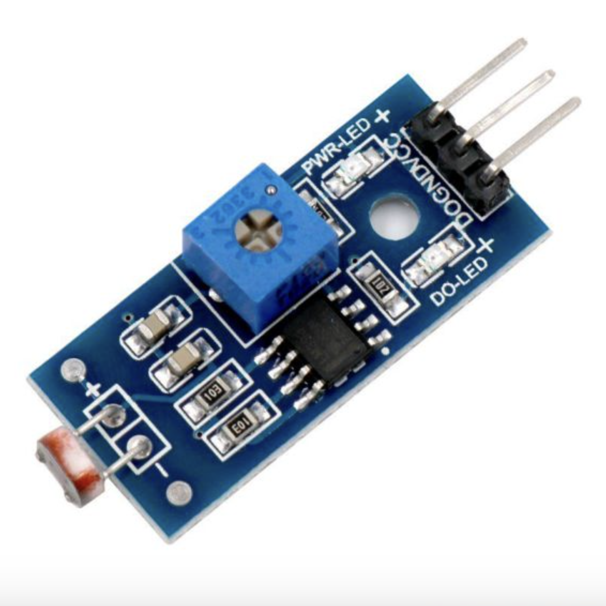
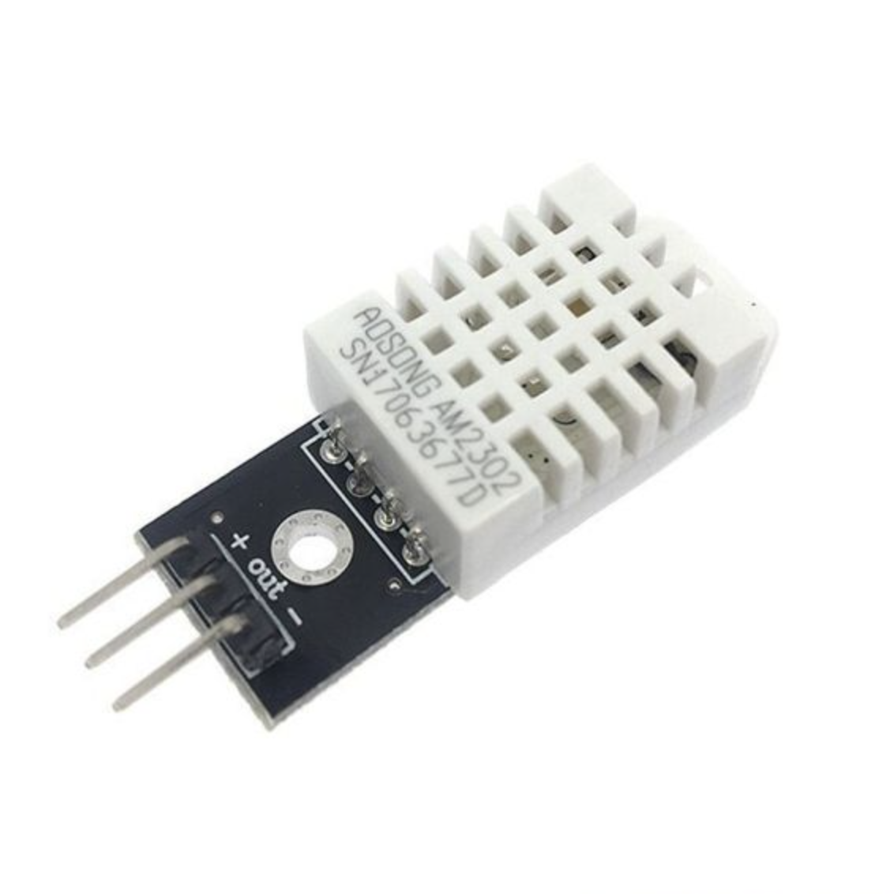
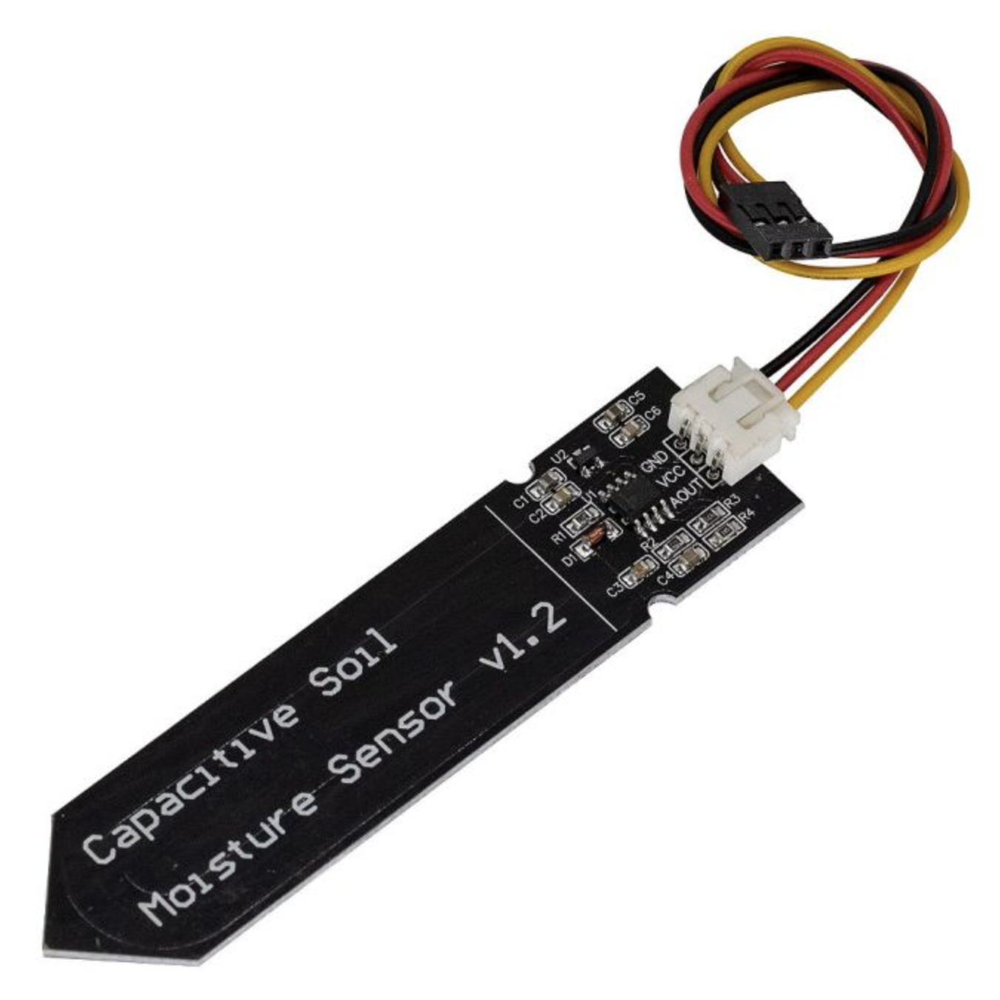
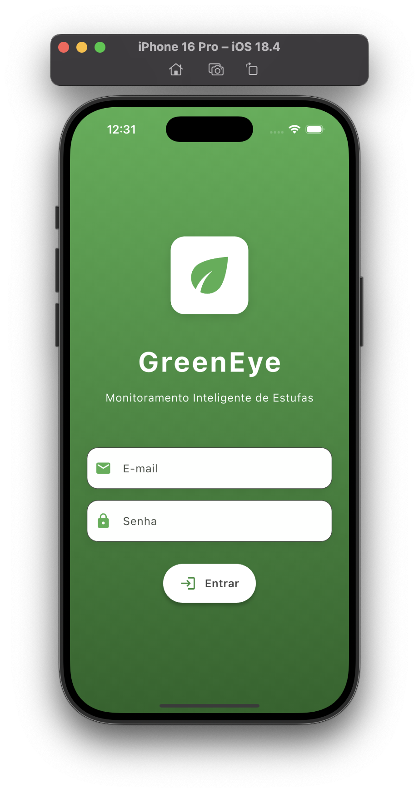
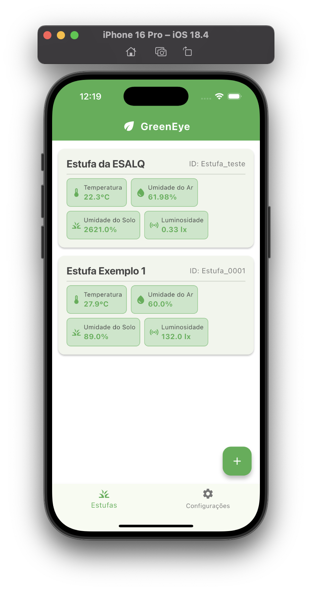
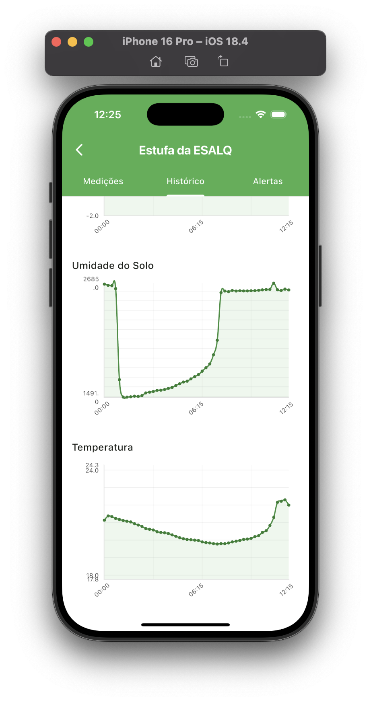

# GreenEye 🌱👁️

Sistema multi-plataforma de monitoramento inteligente de estufas, desenvolvido na disciplina SSC0620 - Engenharia de Software do ICMC - USP, ministrada pela Profa. Dra. Simone do Rocio Senger de Souza, em parceria com a ESALQ - USP. 

Link do vídeo de apresentação: []()

> Versão atual: 0.9.1 (Beta)

| Alunos | NUSP |
| :---: | :---: | 
| Leonardo Gueno Rissetto | 13676482 |
| Lucas Lima Romero | 13676325 |
| Luciano Gonçalves Lopes Filho | 13676520 |
| Manoel Thomaz Gama da Silva Neto | 13676392 |
| Marco Antonio Gaspar Garcia | 11833581 |
| Thiago Kashivagui Gonçalves | 13676579 |


## 📑 Descrição
O GreenEye foi desenvolvido para ser o projeto de avaliação da disciplina de Engenharia de Software, que ocorreu no 1º semestre de 2025. A ideia do projeto surgiu a partir de uma parceria entre o ICMC (Instituto de Ciências Matemáticas e de Computação) e a ESALQ (Escola Superior de Agricultura Luiz de Queiroz), ambos institutos da USP (Universidade de São Paulo), em que buscou-se resolver um problema dos estudantes e pesquisadores de agronomia: o **controle das variáveis do ambiente da estufa** em que estão conduzindo seus experimentos.

Para isso, projetamos e desenvolvemos um **sistema completo**, de forma que o pesquisador pode acompanhar os dados da sua estufa de qualquer lugar do mundo, bastando ter acesso à Internet. Assim, diminui-se a ocorrência de erros humanos na realizações de estudos científicos, assim como a necessidade de aferições manuais de certos tipos de dados.

Abaixo, pode-se ver uma representação de como o sistema funciona. Em cada estufa que deseja-se monitorar, deve ser instalado um circuito físico com acesso à Internet. Esse circuito coleta dados dos diferentes sensores em tempo real, e publica-os no banco de dados na nuvem. O aplicativo lê esses dados e os apresenta de maneira elegante, de forma que o usuário pode visualizar como estão as variáveis do ambiente de sua estufa.

<p align="center">
  
</p>
<p align="center">
  <a style="font-size: 12px; text-decoration: none; color: inherit;">
    Diagrama conceitual do sistema envolvendo suas diferentes partes
  </a>
</p>

Enquanto um circuito mede e envia dados de apenas uma estufa (1:1), no aplicativo pode-se monitorar quantas estufas desejar (1:N), permitindo um amplo controle de diferentes experimentos científicos com plantas em estufas simultaneamente. Outros diagramas podem ser observados na pasta `/uml`, em formato PlantUML.

## ✍️ Desenvolvedores
Alunos de Engenharia de Computação da USP São Carlos. 
| [<br><sub>Leonardo Rissetto</sub>](https://github.com/LeoRissetto) | [<br><sub>Lucas Romero</sub>](https://github.com/lucaslimaromero) | [<br><sub>Luciano Lopes</sub>](https://github.com/lopesluciano) | [<br><sub>Manoel Thomaz</sub>](https://github.com/thneto1103) | [<br><sub>Marco Garcia</sub>](https://github.com/marcogarcia2) | [<br><sub>Thiago Gonçalves</sub>](https://github.com/thiagokg314) |
| :---: | :---: | :---: | :---: | :---: | :---: |
| Fullstack Developer | UI/UX Designer | Electronics Engineer | Weed Supplier | PO & Scrum Master | Commercial Director |
 

## 🖥️ Especificações do Sistema
O sistema `GreenEye` engloba um **circuito físico** que coleta dados da estufa em tempo real, um **banco de dados** em nuvem que recebe esses dados e um **aplicativo** multi-plataforma que pode ler e exibir esses dados. Vamos agora explicar cada parte do sistema mais a fundo.

### ⚡️ Circuito Físico
---
O circuito físico responsável por coletar dados foi implementado utilizando ESP32, um microcontrolador amplamente utilizado em aplicações IoT (*Internet of Things*). Por possuir conexão WiFi nativa, o uso desse microcontolador permitiu uma rápida prototipação e simples implementação. Os sensores utilizados no sistema e a grandeza física a eles associada foram:
- Módulo LDR (Luminosidade);
- Módulo DHT22 (Temperatura e Umidade do Ar)
- Sensor Capacitivo v1.2 (Umidade de Solo)

<table align="center">
  <tr>
    <td align="center">
        <br>
        Microcontrolador ESP32
      </a>
    </td>
    <td align="center">
        <br>
        Módulo Sensor LDR
      </a>
    </td>
    <td align="center">
        <br>
        Módulo Sensor DHT22
      </a>
    </td>
    <td align="center">
        <br>
        Sensor Capacitivo v1.2 de Umidade do Solo
      </a>
    </td>
  </tr>
</table>

O código que define o comportamento do ESP32 foi compilado e carregado com a **Arduino IDE**, e pode ser visto na pasta `/firmware`. Para o funcionamento correto do programa é necessária a criação de um arquivo chamado `secret.h` que contém definições sensíveis como:
- SSID e Senha da rede WiFi do local em que o circuito está instalado;
- ID e Senha do banco de dados;
- ID da Estufa (interno à implementação);

Por motivos óbvios, este arquivo foi omitido do repositório GitHub.

### 🔥 Banco de Dados
---
O Banco de Dados utilizado no projeto foi o **Realtime Database** do Google Firebase. Trata-se de um banco não-relacional em nuvem, uma solução gratuita da Google que possibilita uma prototipação eficiente. Cada circuito físico está associado a apenas uma estufa, e para cada uma delas, existe uma chave no banco de dados. Todos os dados referentes à essa estufa estarão guardados por essa chave, chamada de `ID_ESTUFA`, e o circuito físico associado só escreve nessa chave. 

A estrutura básica em que o banco de dados foi modelado é representada abaixo. Os três pontos (...) indicam repetição seguindo o padrão acima. 

```json
{
  "Estufa_0001": {

    "name": "Estufa da ESALQ",
    "password": "senha123", 
    
    "2025-06-08": {
      "hum": {
        "11:15": 79.02,
        "11:30": 83.76,
        "11:45": 85.78,
        "12:00": 85.26,
        ...
      },
      "lum": {
        "11:15": 1846,
        "11:30": 1565,
        "11:45": 2059,
        "12:00": 1772,
        ...
      },
      "moist": {
        "11:15": 2630,
        "11:30": 2604,
        "11:45": 2612,
        "12:00": 2606,
        ...
      },
      "temp": {
        "11:15": 26.56,
        "11:30": 24.64,
        "11:45": 24.6,
        "12:00": 24.56,
        ...
      }
    },

    "2025-06-09": {
      "hum": {
        ...
      },
      "lum": {
        ...
      },
      "moist": {
        ...
      },
      "temp": {
        ...
      }
    },

    "2025-06-10": {
      ...
    },
    
    ...

  },

  "Estufa_0002": {
    ...
  },

  "Estufa_0003": {
    ...
  }

  ...

}
```


### 📲 Aplicativo
---
O aplicativo foi desenvolvido através do framework **Flutter**, empregando a linguagem de programação **Dart**. Essa escolha se deve à sua flexibilidade, em que um único código fonte é compilado e carregado para diferentes plataformas. Todo o código fonte referente ao aplicativo pode ser visto na pasta `/lib`, enquanto que as demais pastas são referentes ao ambiente de configuração do projeto e das plataformas destinadas. O foco principal do sistema é mobile, mas possivelmente pode ser expandido para outras plataformas no futuro.

O aplicativo permite o monitoramento de diferentes estufas simultaneamente. A primeira figura mostra a tela de login do aplicativo. Na segunda figura, é mostrada a tela inicial, em que se exibe a última medição realizada de cada estufa, ou seja exibe o estado atual da estufa. Além disso, clicando em uma estufa, pode-se obter uma visualização mais detalhada dos seus dados. Pode-se visualizar seus dados por horário e por data, além de ver sua evolução através de gráficos, como mostra a terceira figura.

<table align="center">
  <tr>
    <td align="center">
        <br>
        Tela de Login do Aplicativo
      </a>
    </td>
    <td align="center">
        <br>
        Tela Home do Aplicativo
      </a>
    </td>
    <td align="center">
        <br>
        Tela de Visualização Gráfica dos Dados
      </a>
    </td>
  </tr>
</table>

## ⚒️ Como utilizar
Para utilizar o projeto GreenEye em sua totalidade, é necessário configurar tanto o **circuito físico (ESP32)** quanto o **aplicativo mobile**. Além disso, deve-se criar o seu próprio projeto no Google Firebase. O primeiro passo é clonar o repositório com:
```bash
git clone git@github.com:marcogarcia2/green_eye.git
cd greeneye
```

### 1. Montando e configurando o circuito físico
Para a **montagem** do circuito físico, é preciso ter os componentes descritos na seção acima.
1. Ligue os Módulos LDR e DHT22 em 3.3V e GND, e ligue o Sensor Capacitivo de Umidade de Solo no 5V e GND. Ambas as alimentações são pinos de saída do próprio ESP32. 
2. Ligue a saída digital do módulo DHT22 em qualquer pino de leitura digital do ESP32. 
3. Ligue a saída analógica do módulo LDR em qualquer pino de leitura analógica do ESP32.
4. Ligue a saída analógica do Sensor Capacitivo de Umidade do Solo em qualquer pino de leitura analógica do ESP32.

Pronto! Seu circuito está preparado para operar, basta ligar o ESP32 com alguma fonte de alimentação. Vamos agora **carregar o código** para o microcontrolador. Navegue até a pasta `/firmware` com:
```bash
cd firmware
```
1. Conecte o ESP32 no seu computador via cabo MicroUSB - USB.
2. Através da Arduino IDE, selecione o dispositivo (no meu caso: ESP32 Dev Module). Pode ser que você precise instalar a biblioteca de dispositivos ESP32.
3. Baixe a biblioteca *DHT sensor library* da Adafruit.
4. Siga os passos do [vídeo](https://www.youtube.com/watch?v=_ADdFH2K7SI) para instalar as bibliotecas para integração com Firebase.
5. Crie o arquivo `secret.h` no mesmo diretório com:
```bash
touch secret.h
```
6. Neste arquivo, escreva o seguinte:
```C
#define ID_ESTUFA "ID_da_Estufa_no_banco_de_dados"

#define WIFI_SSID "nome_da_sua_rede_wifi"
#define WIFI_PASSWORD "nome_da_sua_rede_wifi"

#define FIREBASE_HOST "endereco_do_banco_de_dados"
#define FIREBASE_AUTH "senha_do_banco_de_dados"
```
7. Salve e clique em **Upload** no canto superior esquerdo.

Pronto! O circuito físico já está funcionando corretamente.

### 2. Configurando o projeto Flutter
Como pré-requisito, é necessário ter o Flutter instalado no sistema. 
1. Navegue até a a pasta raiz do projeto e rode o comando para instalar as dependências:
```bash
flutter pub get
```
2. Conecte algum dispositivo (celular android) ou abra um emulador
3. Rode o aplicativo com:
```bash
flutter run
```
4. Se quiser gerar o APK para instalação em dispositivos Android, execute:
```bash
flutter build apk --release
```
5. O APK será gerado após alguns minutos e estará localizado em `/build/app/outputs/flutter-apk/app-release.apk`. 


## 🔮 Melhorias futuras
Como possibilidade de expansão e melhorias futuras para o projeto, elencamos aqui algumas possibilidades:
- Implementação de **Sistema de notificações**, caso alguma variável ultrapasse algum valor crítico estipulado
- Maior possibilidade de controle e integração e **automação** da estufa via app, por exemplo: ativar climatizador via app, ativar rega de plantas via app...
- Melhor empacotamento do circuito, fazendo uma PCB própria
- Expansão para diferentes plataformas, como Windows, MacOS, Linux...
- Pensar em melhorias de escalabilidade
